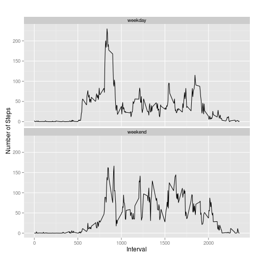

# Reproducible Research: Peer Assessment1

## Loading and preprocessing the data

```r
library(knitr)
theData <- read.csv('/home/rodney/Projects/Git_repos/RepData_PeerAssessment1/activity.csv', stringsAsFactors=FALSE, header=TRUE)
#omit any NA's:
theData2 <- na.omit(theData)
#aggregate steps for each date:
totalSteps <- aggregate(steps~date,theData2,sum)
```

## Histogram of the total number of steps taken each day:

```r
hist(totalSteps$steps, col=1,main='Total steps taken each day',xlab='Total steps')
```

 

## What is mean and median total number of steps taken per day?

```r
#library(plyr)
#ddply(theData2, .(date),summarize, mean=mean(steps, na.rm=TRUE), median=median(steps, na.rm=T))

mean(totalSteps$steps)
```

```
## [1] 10766
```

```r
median(totalSteps$steps)
```

```
## [1] 10765
```

## What is the average daily activity pattern?

```r
# aggregrate steps for each interval to get mean number of steps per interval
intervalSteps<- aggregate(steps ~ interval, theData2, mean)
#plot the line graph:
plot(intervalSteps$interval,intervalSteps$steps,type='l', col=1,main='Average number of steps for all days',xlab='Interval',ylab='Average number of steps')
```

 

```r
#find row id of of max average number of steps
masRow <- which.max(intervalSteps$steps)
#find which interval has the max avg number of steps
intervalSteps[masRow,]
```

```
##     interval steps
## 104      835 206.2
```
Maximum average number of steps is 206 found in 5-minute interval 835.

## Imputing missing values

```r
#theData$steps is only variable with NA's:
colSums(is.na(theData))
```

```
##    steps     date interval 
##     2304        0        0
```
the dataset has 2304 rows with NA's

## Fill in NAs of the dataset step variable with the mean for that time interval and set it a new dataset called newData:

```r
newData <- theData
for(i in 1:nrow(newData)){
  if(is.na(newData$steps[i])){
    intervalVal <- newData$interval[i]
    rowId <- which(newData$interval == intervalVal)
    stepsVal <- intervalSteps$steps[rowId]
    suppressWarnings(newData$steps[i] <- stepsVal)
  }
}
```
#newData mean, median, histogram:

```r
newtotalSteps <- aggregate(steps~date,newData,sum)
hist(newtotalSteps$steps,col=1,main='Sans NAs Histogram of total number of steps taken per day',xlab='Total steps taken per day')
```

 

```r
#mean of steps taken with NAs removed:
mean(newtotalSteps$steps)
```

```
## [1] 10766
```

```r
#median of steps taken with NAs removed:
median(newtotalSteps$steps)
```

```
## [1] 10766
```

```r
#mean of steps taken with NAs
mean(totalSteps$steps)
```

```
## [1] 10766
```

```r
#median of steps taken with NAs
median(totalSteps$steps)
```

```
## [1] 10765
```
The mean does not change when NAs are removed from Data$steps variable. However, the median is slightly affected.

## Are there differences in activity patterns between weekdays and weekends?

```r
#convert date variable from character to date class:
newData$date <- as.Date(newData$date, "%Y-%m-%d")
#add a new variable for day of the week:
newData$day <- weekdays(newData$date)
#add a new variable, 'day_type', and initialize to weekday
newData$day_type <- c('weekday')
#if day is Saturday or Sunday, make day_type set to weekend:
for (i in 1:nrow(newData)){
  if (newData$day[i] == "Saturday" || newData$day[i] == "Sunday"){
    newData$day_type[i] <- "weekend"
  }
}
# convert day_time from character to factor
newData$day_type <- as.factor(newData$day_type)

# aggregate steps as interval to get average number of steps in an interval across all days
newintervalSteps <- aggregate(steps~interval+day_type, newData ,mean)
```
## Make a panel plot of the 5-minute interval (x-axis) and the average number of steps taken averaged across all weekdays or weekend days (y-axis).

```r
library(ggplot2)
qplot(interval, steps,data=newintervalSteps,geom=c('line'),xlab='Interval', ylab='Number of Steps', main='')+facet_wrap(~day_type, ncol=1)
```

 

